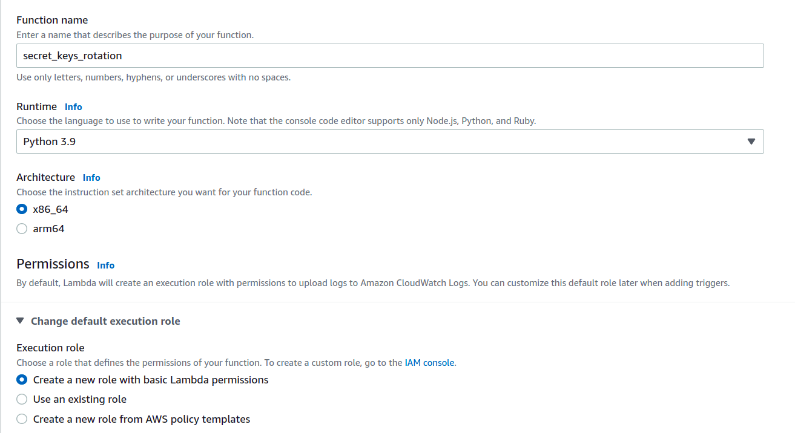
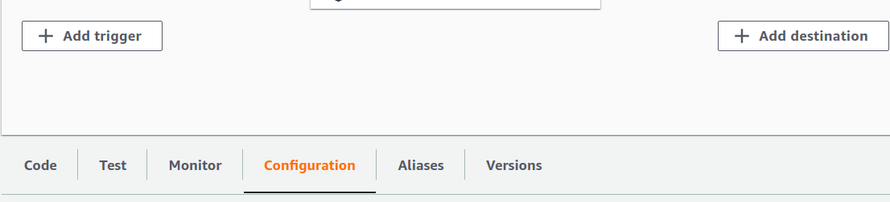
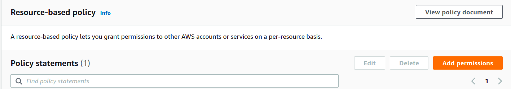
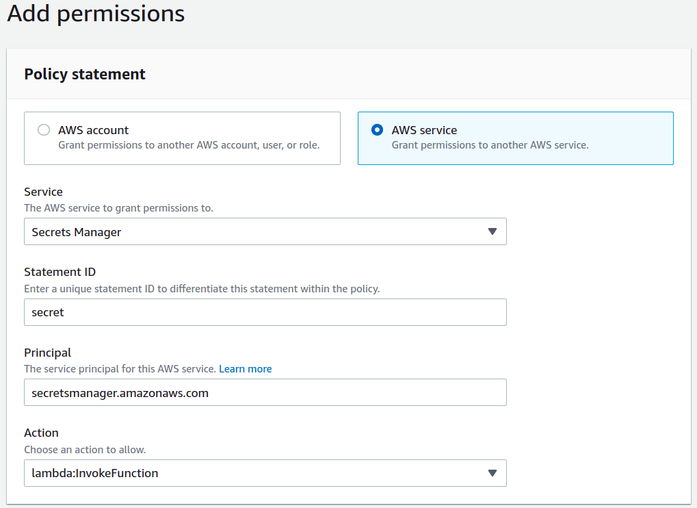
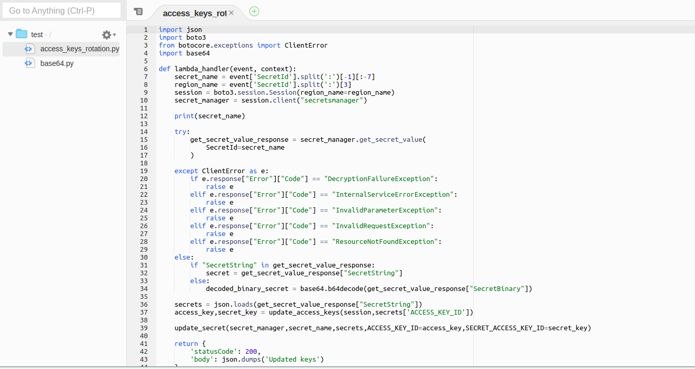
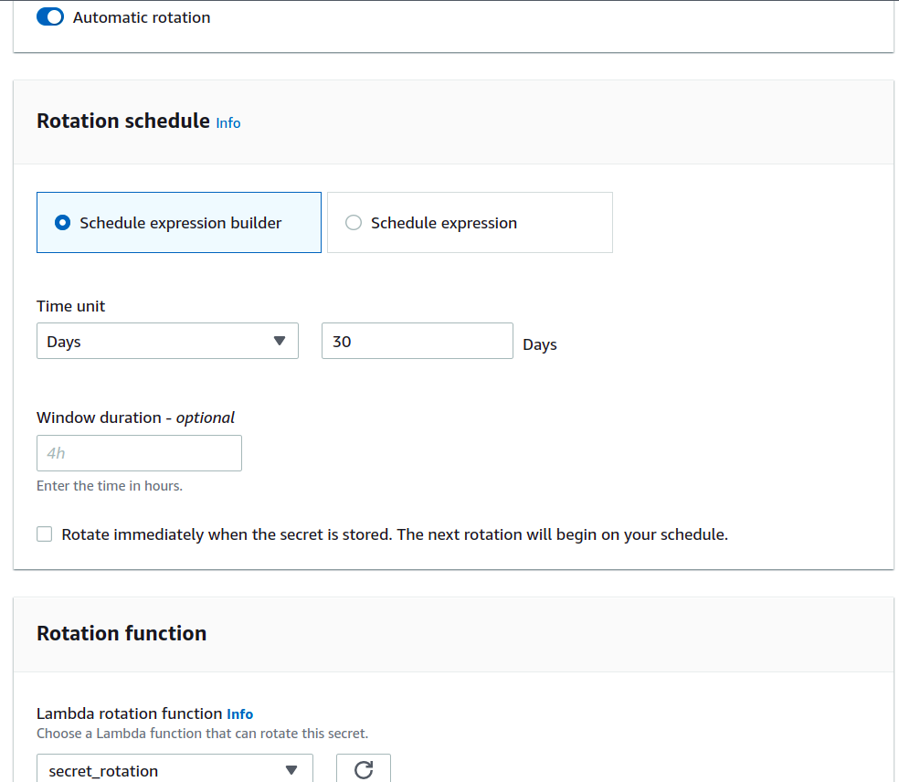

AWS Secret rotation (Access keys)
=====================================

I am a Lambda script to rotate access keys in secret manager.

Methods:
- [MANUAL](https://github.com/DevOpsMusketeers/secretkey-rotation-secretmanager/blob/main/README.md#create-manually)
- [TERRAFORM](https://github.com/DevOpsMusketeers/secretkey-rotation-secretmanager/blob/main/README.md#create-using-terraform)
- [AWS SAM](https://github.com/DevOpsMusketeers/secretkey-rotation-secretmanager/blob/main/README.md#create-using-aws-sam)

Python versions
------------------

Python  >3.8.0

Usage
------

## CREATE MANUALLY:

1. Create Lambda

<div align="center">
  
</div>
<br>
<br>
2. Once Lambda function is created, go to Configuration -> Resource-based-policy -> Add permissions -> AWS Service and select Secret Manager Service from the dropdown and lambda:InvokeFunction as Action

<div align="center">
  
</div>
<br>
<br>
<div align="center">
  
</div>
<br>
<br>
<div align="center">
  
</div>
<br>
<br>
3. Upload the lambda.zip to the newly created Lambda function
<br>
<br>
<div align="center">
  
</div>
<br>
<br>
4. Configure automatic secret rotation in secrets manager
<br>
<br>
<div align="center">
  
</div>

<br>
Note: Use ACCESS_KEY_ID and SECRET_ACCESS_KEY_ID keys for access and secret key respectively in your secret

Below is the format of writing secret manager secret:

```
{
    "ACCESS_KEY_ID": "AKXXXXXXXXXXXXXXX",
    "SECRET_ACCESS_KEY_ID": "tVXXXXXXXXXXXXXXXXXXXXXXXXXXXXXXXXXXXXXX",
    "SOME_OTHER_SECRET": "SOME_OTHER_VALUES",
    .
    .
    .
    and so on
}

```

## CREATE USING Terraform:

Files associated with AWS SAM are:
- *.tf
- lambda.zip

1. Download lambda.zip from this repo and keep it where you want to run your module
2. Usage:

```hcl
provider "aws" {
  region = "us-east-1"
}

module "lambda" {
  source = "git@github.com:DevOpsMusketeers/secretkey-rotation-secretmanager.git"
  function_name = "function_name_of_your_choice"
  filename = "lambda.zip"
}
```

Tags
----
* Tags are assigned to the resource.
* Additional tags can be assigned by appending key-value of tag in security group resource.

Inputs
------
| Name | Description | Type | Default | Required |
|------|-------------|------|---------|:--------:|
| function_name | Lambda function name | `string` | `"access_key_secret_rotation"` | yes |
| filename | Filename that needs to be uploaded  | `string` | `"lambda.zip"` | yes |

Output
------
| Name | Description |
|------|-------------|
| arn | The ARN of the Lambda function |


## CREATE USING AWS SAM:

Clone the repository and follow the below steps.

Files associated with AWS SAM are:
- template.yaml
- lambda.zip

### pre-requisites
- AWS SAM CLI SETUP
- AWS CLI SETUP
- ACCESS KEY & SECRET KEY CONFIGURED [With required permissions]

To initialise AWS SAM template

```
sam build
```

To deploy sam template
```
sam deploy --guided
```

NOTE: Provide values accordingly
